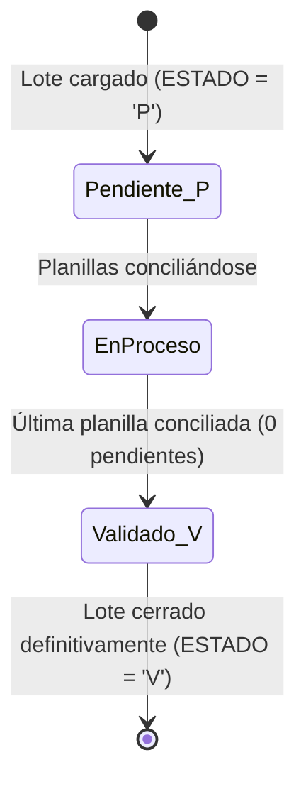
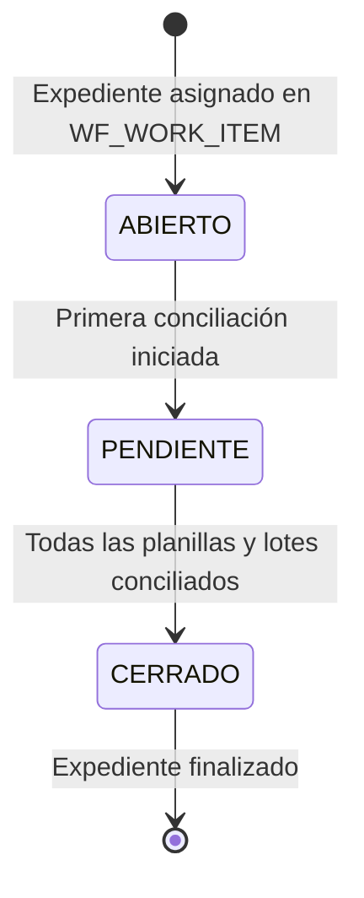

# Informe Técnico: Hallazgo Crítico de Permisos Oracle y Diagnóstico Operacional

**Fecha:** 07 de Septiembre de 2026  
**Entorno Analizado:** Oracle Producción (`10.79.6.247:1521/sige1`) y Certificación/Dev (`172.21.65.90:1521/cert_rep`)  
**Autor:** Antigravity AI  
**Objetivo:** Documentar la causa raíz de la no finalización de lotes/expedientes, la solicitud de permisos requeridos al DBA, y el diagnóstico detallado del caso **22/04/2024 - Banco 105 - Expediente 7638**.

---

## 1. Diagnóstico del Caso: Fecha 22/04/2024 | Banco 105 | Expediente 7638

### 1.1. Las Cifras del Problema (3.636 vs 3.613)
En la operación se observó que para el **Expediente 7638**, correspondiente al **Banco 105**, fecha **22/04/2024** (Agencia `0800`, Lote ID `42`, `LOTE_SEQ: 132164`):
- El archivo o total reportado en `ORG_LIQ.TXT_SENIAT` tiene **3.636 planillas**.
- En las pantallas históricas / reportes se indicaban **3.613 planillas conciliadas**.
- Diferencia observada: **23 planillas pendientes por cargar**.

### 1.2. Hallazgo Matemático y Clasificación Arancelaria
Al auditar directamente los registros de `ORG_LIQ.TXT_SENIAT` en la base de datos de producción (`sige1`):

| Grupo de Formas | Código de Forma | Cantidad | Descripción |
| :--- | :--- | :--- | :--- |
| **Rentas Internas / Ordinarias** | `99005`, `99016`, `99020`, `99021`, `99025`, `99026`, `99028`, `99030`, `99032`, `99033`, `99035`, `99044`, `99074`, `99076`, `99086`, `99225`, `99228`, `99229`, `99232`, `99262`, `99901`, `99903` | **3.604** | Tributos nacionales (ISLR, IVA, etc.) |
| **Depuradas** | `79984` | **9** | Planillas marcadas con `ESTADO = -1` |
| **Subtotal Rentas Internas** | | **3.613** | **Exactamente las 3.613 planillas procesadas originalmente** |
| **Aduanas (Forma Especial 1)** | `99080` | **8** | Declaración de Aduanas |
| **Aduanas (Forma Especial 2)** | `99081` | **15** | Declaración de Aduanas |
| **Subtotal Aduanas** | `99080` + `99081` | **23** | **Las 23 planillas de la diferencia exacta (8 + 15 = 23)** |
| **TOTAL GENERAL** | | **3.636** | **3.613 + 23 = 3.636 planillas** |

> [!NOTE]
> La brecha de **23 planillas** corresponde exactamente y en su totalidad a planillas de **Aduanas** (8 planillas de la forma `99080` y 15 planillas de la forma `99081`). En el flujo histórico tradicional de SIGECOF/SENIAT, estas formas aduaneras suelen ser tratadas por separado o quedan relegadas, lo que originó que el lote quedara con 3.613 conciliadas y 23 pendientes.

---

### 1.3. ¿Por qué "al descargar no sale nada" (0 registros devueltos)?
Al intentar consultar o descargar las planillas pendientes en el motor de conciliación, la respuesta es vacía (0 registros). La investigación técnica arrojó dos motivos concluyentes:

1. **Las 23 planillas ya fueron conciliadas exitosamente hoy:**  
   Al revisar `ORG_LIQ.PLANILLA` para el lote `132164`, se constató que las 23 planillas (`99080` y `99081`) **fueron insertadas el día de hoy entre las 14:20:02 y las 14:20:29** con sus respectivos 3 registros en `ORG_LIQ.DET_PLANILLA`. Además, en `ORG_LIQ.TXT_SENIAT`, el campo `ESTADO` de estas 23 planillas fue actualizado a `1`.
   
   Distribución actual de `ORG_LIQ.TXT_SENIAT` para esa fecha y agencia:
   - `ESTADO = 1` (Conciliadas): **3.627 filas** (3.604 ordinarias + 23 aduanas).
   - `ESTADO = -1` (Depuradas): **9 filas** (Forma `79984`).
   - `ESTADO IS NULL`: **0 filas**.

2. **Condición estricta del Query de Consulta en el Motor (`planillas.service.ts`):**  
   El método `getPendientes` filtra por:
   ```sql
   WHERE L.ESTADO = 'P'
     AND T.ESTADO IS NULL 
     AND NOT EXISTS (
       SELECT 1 FROM ORG_LIQ.PLANILLA P 
       WHERE P.PLANILLA_ID = T.PLANILLA 
         AND P.LOTE_SEQ = L.LOTE_SEQ 
         AND P.ANHO = L.ANHO
     )
   ```
   Como en la base de datos **ya no existe ninguna planilla con `T.ESTADO IS NULL`** ni ninguna planilla que no esté ya registrada en `ORG_LIQ.PLANILLA`, la consulta devuelve legítimamente **cero filas**.

3. **La Paradoja del Lote "Falso Pendiente":**  
   El lote `132164` tiene en la realidad el **100% de sus planillas procesadas** (3.627 conciliadas + 9 depuradas = 3.636). Sin embargo, en la tabla `ORG_LIQ.LOTE`, el campo `ESTADO` continúa con el valor `'P'` (Pendiente).  
   Cualquier usuario o reporte que consulte la cabecera del lote ve que dice `ESTADO = 'P'` y asume que faltan planillas por cargar; pero al pulsar "Descargar / Ver Pendientes", el motor no trae nada porque **no queda nada pendiente**.

---

## 2. Hallazgo Crítico de Permisos en Oracle (`ORG_LIQ.LOTE` y `WF_EXPEDIENTE`)

### 2.1. Causa Raíz de los Lotes No Cerrados
Durante la conciliación masiva efectuada hoy, el motor procesó las planillas pero **el lote no se cerró** (se mantuvo en `ESTADO = 'P'`).

Al auditar la vista de privilegios `USER_TAB_PRIVS` para el usuario de conexión del bot (`ONT_SIR_BOT`), se descubrió la causa técnica:

```json
[
  { "OWNER": "ORG_LIQ", "TABLE_NAME": "LOTE",         "PRIVILEGE": "SELECT" },
  { "OWNER": "ORG_LIQ", "TABLE_NAME": "PLANILLA",     "PRIVILEGE": "SELECT, INSERT, DELETE" },
  { "OWNER": "ORG_LIQ", "TABLE_NAME": "DET_PLANILLA", "PRIVILEGE": "SELECT, INSERT, DELETE" },
  { "OWNER": "ORG_LIQ", "TABLE_NAME": "TXT_SENIAT",   "PRIVILEGE": "SELECT, UPDATE" },
  { "OWNER": "WFE_WORKFLOW", "TABLE_NAME": "WF_WORK_ITEM", "PRIVILEGE": "SELECT, INSERT, UPDATE" },
  { "OWNER": "WFE_WORKFLOW", "TABLE_NAME": "WF_EXPEDIENTE","PRIVILEGE": "SELECT" }
]
```

> [!CAUTION]
> El usuario `ONT_SIR_BOT` **únicamente posee privilegio `SELECT` sobre `ORG_LIQ.LOTE`**.  
> Carece del privilegio `UPDATE`. Por esta razón, cualquier intento del motor de ejecutar:
> ```sql
> UPDATE ORG_LIQ.LOTE SET ESTADO = 'V' WHERE LOTE_SEQ = :loteSeq
> ```
> es rechazado por el motor Oracle con el error:  
> **`ORA-01031: insufficient privileges`**.

### 2.2. Sentencias SQL Requeridas al Administrador de Base de Datos (DBA)
Para que el motor de conciliación pueda cerrar los lotes y gestionar integralmente los expedientes, se debe solicitar al DBA la ejecución de los siguientes `GRANTs` en la base de datos de Certificación y Producción:

```sql
-- 1. Permiso indispensable para cerrar / validar los lotes al terminar la conciliación:
GRANT UPDATE ON ORG_LIQ.LOTE TO ONT_SIR_BOT;

-- 2. Permiso para actualizar el estado del expediente en la cabecera de Workflow:
GRANT UPDATE ON WFE_WORKFLOW.WF_EXPEDIENTE TO ONT_SIR_BOT;
```

---

## 3. Modelo de Ciclo de Vida y Trazabilidad

A continuación se detalla la especificación lógica requerida para la gestión de estados y trazabilidad en `motor_app`.

### 3.1. Ciclo de Vida del Lote (`ORG_LIQ.LOTE`)


- **Regla de Cierre Automático:**  
  Tras procesar una planilla o lote masivo, el backend evalúa si quedan planillas pendientes asociadas a dicho `LOTE_SEQ`.  
  Si el conteo de pendientes es **0**, ejecuta automáticamente:
  ```sql
  UPDATE ORG_LIQ.LOTE 
  SET ESTADO = 'V' 
  WHERE LOTE_SEQ = :loteSeq AND ANHO = :anho;
  ```
- **Regla de Verificación Previa:**  
  Si un operador abre un lote con `ESTADO = 'P'`, pero la consulta de planillas pendientes devuelve 0, el sistema debe ofrecer la acción de **"Cerrar / Validar Lote Pendiente"** para sincronizar su estado a `'V'` y sanear la inconsistencia.

---

### 3.2. Ciclo de Vida del Expediente (`WFE_WORKFLOW`)


1. **Estado Inicial (`ABIERTO`):**  
   Al consultar un expediente, el motor verifica su estado en `WF_WORK_ITEM` (`WI_ESTADO`) y el usuario asignado (`WFUS_USERS_ID`).  
2. **Transición a `PENDIENTE`:**  
   Si el expediente está `ABIERTO`, **antes de ejecutar la primera acción o conciliación**, el motor actualiza su estado a `PENDIENTE`:
   ```sql
   UPDATE WFE_WORKFLOW.WF_WORK_ITEM
   SET WI_ESTADO = 'PENDIENTE'
   WHERE WFEX_EXP_ID = :expId AND ANHO = :anho AND WORKITEM = :workItem;
   ```
3. **Transición a `CERRADO`:**  
   Cuando todos los lotes asociados al expediente tengan `ESTADO = 'V'` y no existan planillas pendientes, el expediente pasa a `CERRADO` tanto en `WF_WORK_ITEM` como en `WF_EXPEDIENTE`.

---

### 3.3. Trazabilidad y Logs en `motor_app`
Toda acción y cambio de estado debe quedar registrado en la base de datos de auditoría (`motor_app`):

| Campo | Descripción | Ejemplo |
| :--- | :--- | :--- |
| `timestamp` | Fecha y hora exacta con milisegundos | `2026-09-07T14:20:02.124Z` |
| `usuario_operador` | Identificador del operador o bot | `NAZARETHSERRANO` / `ONT_SIR_BOT` |
| `entidad` | Objeto que sufre la transición | `LOTE` o `EXPEDIENTE` |
| `entidad_id` | Identificador clave | `LOTE_SEQ: 132164` o `EXP_ID: 7638` |
| `estado_anterior` | Estado previo a la acción | `'P'` / `'ABIERTO'` |
| `estado_nuevo` | Nuevo estado tras la acción | `'V'` / `'PENDIENTE'` / `'CERRADO'` |
| `planillas_afectadas`| Cantidad de planillas involucradas | `23` |
| `origen` | Módulo ejecutor | `Motor Conciliación - Masiva` |

Estos eventos se visualizan en la pestaña de **Trazabilidad y Logs** de la interfaz web para garantizar auditoría completa de cada movimiento.

---

## 4. Conclusiones y Próximos Pasos (Sin cambios de código en esta fase)

1. **El caso del Expediente 7638 está resuelto en cuanto a planillas:**  
   Las 23 planillas de aduanas ya existen en la base de datos de producción con sus detalles contables y estado conciliado. La razón por la que "no sale nada" al descargar es porque **no hay nada pendiente por cargar**.
2. **El bloqueo remanente es el permiso de cierre de lotes:**  
   El Lote 42 permanece con `ESTADO = 'P'` únicamente porque `ONT_SIR_BOT` carece del `GRANT UPDATE ON ORG_LIQ.LOTE`.
3. **Paso requerido con DBA:**  
   Solicitar formalmente la aplicación de:
   ```sql
   GRANT UPDATE ON ORG_LIQ.LOTE TO ONT_SIR_BOT;
   GRANT UPDATE ON WFE_WORKFLOW.WF_EXPEDIENTE TO ONT_SIR_BOT;
   ```
4. **Posterior a la concesión de permisos:**  
   Se implementará en el código del motor la lógica de actualización atómica del estado del Lote (`'P'` -> `'V'`) y la transición controlada del Expediente (`ABIERTO` -> `PENDIENTE` -> `CERRADO`) junto a su persistencia en el módulo de auditoría de `motor_app`.
