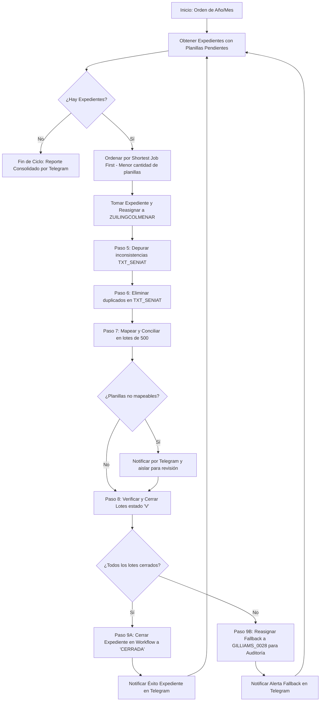

# ESPECIFICACIÓN TÉCNICA DEL ALGORITMO: BOT CONCILIADOR AUTÓNOMO

Este documento define la secuencia lógica, condiciones operativas, reglas de negocio y mecanismos de contingencia para el Bot Autónomo de Conciliación y Cierre de Expedientes en SIGECOF (Ambiente Producción / Desarrollo - Órgano ONT `093`).

---

## 1. Parámetros de Entrada y Configuración Inicial

El Bot opera en base a una orden de ejecución que define el alcance de trabajo:
- **Año Objetivo (`ANHO`):** Ej. `2024`.
- **Mes Objetivo (`MES`):** Ej. `04` (Abril).
- **Criterio Temporal:** Rango de fecha de recaudación bancaria:
  ```text
  FECHA_INICIO = YYYY-MM-01
  FECHA_FIN    = YYYY-MM-(Último día del mes)
  Filtro BD    : ORG_LIQ.LOTE.FECHA_RECAUDACION BETWEEN :inicio AND :fin
  ```
- **Disparador:** Comando recibido vía Telegram (`/conciliar 2024 04`) o disparado desde la plataforma Web.

---

## 2. Secuencia Operativa Detallada (Paso a Paso)



### Paso 1: Inicialización y Carga de Rango
- El operador envía la instrucción `/conciliar <AÑO> <MES>`.
- El bot valida las credenciales y el estado de conexión con la base de datos de SIGECOF.
- Envía notificación a Telegram:
  > *🚀 "Iniciando ciclo de conciliación para el período: 04/2024. Buscando expedientes elegibles..."*

### Paso 2: Búsqueda y Filtrado de Expedientes Elegibles
- El bot consulta en `WFE_WORKFLOW.WF_WORK_ITEM` y `ORG_LIQ.LOTE` aquellos expedientes que cumplan simultáneamente:
  1. `W.ORGA_ID IN ('93', '093')` (Órgano ONT).
  2. `W.WFTA_TAREA_ID = 2061` (Tarea de Recepción / Conciliación).
  3. `W.WFUS_USERS_ID = 'GILLIAMS_0028'` (Usuario asignado inicial).
  4. `W.WI_ESTADO = 'ABIERTA'` (Workitem activo).
  5. `W.WORKITEM = (SELECT MAX(W2.WORKITEM) FROM WFE_WORKFLOW.WF_WORK_ITEM W2 WHERE W2.WFEX_EXP_ID = W.WFEX_EXP_ID AND W2.ANHO = W.ANHO AND W2.ORGA_ID = W.ORGA_ID)`.
  6. Poseer lotes en `ORG_LIQ.LOTE` con `FECHA_RECAUDACION` en el mes objetivo y `ESTADO = 'P'`.
  7. Contar con planillas en `ORG_LIQ.TXT_SENIAT` pendientes (`ESTADO IS NULL` o `0`).

### Paso 3: Priorización por Menor Volumen (Shortest Job First - SJF)
- Para maximizar la tasa de expedientes cerrados rápidamente, el bot calcula el conteo de planillas pendientes de cada expediente y los ordena ascendentemente:
  ```sql
  ORDER BY COUNT(T.PLANILLA) ASC, L.EXPEDIENTE ASC
  ```
- Selecciona el primer expediente de la cola de trabajo.

### Paso 4: Reasignación Operativa a `ZUILINGCOLMENAR`
- Para aislar el expediente y evitar interferencia de transcriptores humanos durante el proceso automatizado, el bot reasigna el expediente al usuario de servicio:
  - **Usuario Destino:** `ZUILINGCOLMENAR` (Nombre: *Jhonny Doria*, Rol: `R_TNIN_VALIDA`, Estatus: `A`, Órgano: `93`).
- **Mecanismo:** `UPDATE` *in-situ* sobre `WFE_WORKFLOW.WF_WORK_ITEM` (sin duplicar filas):
  ```sql
  UPDATE WFE_WORKFLOW.WF_WORK_ITEM
  SET WFUS_USERS_ID = 'ZUILINGCOLMENAR',
      WI_OBSERVACION = 'Asignado a Bot Conciliador para procesamiento autonomo'
  WHERE WFEX_EXP_ID = :expediente
    AND ANHO = :anho
    AND ORGA_ID = :orgaId
    AND WORKITEM = :workitem
    AND WI_ESTADO = 'ABIERTA'
  ```
- **Auditoría:** Inserta traza en `WFE_WORKFLOW.WF_AUDITA_EXPEDIENTES`:
  - `EXPEDIENTE_ID = :expediente`
  - `ORGANISMO_ID = '093'`
  - `USUARIO_APLICATIVO = 'BOT_ORQUESTADOR'`
  - `USUARIO_ORACLE = USER`
  - `FECHA_HORA = SYSDATE`
- Envía notificación a Telegram:
  > *📋 "Procesando Expediente #{EXP} ({N} planillas pendientes). Reasignado a ZUILINGCOLMENAR."*

### Paso 5: Depuración de Inconsistencias en `TXT_SENIAT`
- El bot invoca el servicio de depuración (`depuracion.service.ts`) para el expediente en curso:
  - Detecta registros con longitudes inválidas, cuentas corruptas o montos en cero.
  - Elimina o rectifica los registros corruptos de `ORG_LIQ.TXT_SENIAT` asociados a los lotes del expediente.

### Paso 6: Verificación y Depuración de Planillas Duplicadas
- El bot verifica si existen registros duplicados en `ORG_LIQ.TXT_SENIAT` (mismo número de planilla transmitido más de una vez para la misma fecha y banco):
  - Ejecuta la depuración de duplicados dejando únicamente el registro original válido.
  - Ajusta el campo `TOTAL_PLN` en `ORG_LIQ.LOTE` para que el balance del lote refleje la cantidad real neta.

### Paso 7: Mapeo y Conciliación por Lotes de 500 (Regla de Mapeo Previo)
- **Fase de Mapeo:**
  - El bot toma las planillas pendientes y consulta el catálogo presupuestario para asociar a cada una su forma (`FORMA_CODIGO`) y partida presupuestaria (`PLUC_ID` / `cod_partida`).
  - **Manejo de Excepciones (Opción A):**
    - Si una planilla tiene forma desconocida o no puede ser mapeada automáticamente, **no detiene el proceso de las demás**.
    - Concilia todas las planillas que sí son válidas.
    - Las planillas no mapeables se conservan en estado pendiente y se genera un reporte de alerta detallado por Telegram:
      > *⚠️ "Expediente #{EXP}: {X} planillas no pudieron mapearse por catálogo (Formas: {LISTA}). Quedarán pendientes para revisión manual."*
- **Fase de Conciliación en Bloques de 500:**
  - Divide las planillas mapeadas en fragmentos máximos de 500 registros.
  - Inserta en `ORG_LIQ.PLANILLA` y `ORG_LIQ.DET_PLANILLA`.
  - Actualiza `ORG_LIQ.TXT_SENIAT.ESTADO = 1` y asigna `LOTE_SEQ` y `PLAN_SEQ`.
  - La transacción es atómica por cada bloque de 500 (`COMMIT` únicamente al completar el lote).

### Paso 8: Cierre Automático de Lote (`ESTADO = 'V'`)
- Una vez procesadas las planillas de cada lote del expediente, el bot invoca el método interno:
  ```typescript
  planillasService.verificarYCerrarLote(loteSeq, anho, 'BOT_ORQUESTADOR')
  ```
- **Condición de Cierre:**
  - Verifica que `COUNT(PLANILLA) >= LOTE.TOTAL_PLN` y `TOTAL_PLN > 0`.
  - Si cumple, ejecuta:
    ```sql
    UPDATE ORG_LIQ.LOTE
    SET ESTADO = 'V'
    WHERE ANHO = :anho AND LOTE_SEQ = :loteSeq AND ESTADO = 'P'
    ```
- **Falla en Cierre de Lote:**
  - Si el lote no cuadra (ej. `conciliadas < totalPln`), **no fuerza el cierre**.
  - Envía alerta inmediata por Telegram:
    > *🚨 "ALERTA: No se pudo cerrar Lote #{LOTE_ID} (Seq {LOTE_SEQ}) del Expediente #{EXP}. Banco: {BANCO}, Fecha: {FECHA}. Faltan {DIF} planillas por conciliar."*

### Paso 9: Cierre del Expediente o Reasignación de Contingencia (Fallback)
Al culminar la revisión de todos los lotes del expediente:

- **Escenario 9A: Éxito Total (100% Lotes en 'V' y Cero Pendientes en TXT):**
  - Invoca el servicio `cerrarExpedienteYReasignar(dto)`:
    - Actualiza el workitem en `WFE_WORKFLOW.WF_WORK_ITEM`:
      `WI_ESTADO = 'CERRADA'`, `WI_FECHA_CIERRE = SYSDATE`.
    - Pasa el expediente a la siguiente fase de SIGECOF (Validación - Tarea 2062).
  - Envía mensaje de éxito a Telegram:
    > *✅ "EXPEDIENTE #{EXP} CERRADO CON ÉXITO. Total planillas conciliadas: {TOTAL}. Transferido a Validación (Tarea 2062)."*

- **Escenario 9B: Fallo o Conciliación Incompleta (Fallback a `GILLIAMS_0028`):**
  - Si el expediente no pudo cerrarse (quedaron planillas sin mapear, lotes descuadrados o error en BD):
  - El bot **no lo deja en el limbo** ni lo deja asignado a `ZUILINGCOLMENAR`.
  - **Devuelve el expediente al usuario original:**
    - `WFUS_USERS_ID = 'GILLIAMS_0028'`
    - `WI_ESTADO = 'ABIERTA'`
    - `WI_OBSERVACION = 'Bot Conciliador: Incompleto ({MOTIVO}). Devuelto para auditoria y revision manual'`
  - Registra el evento en `WF_AUDITA_EXPEDIENTES`.
  - Envía alerta a Telegram:
    > *⚠️ "EXPEDIENTE #{EXP} NO PUDO CERRARSE. Reasignado de vuelta a GILLIAMS_0028 para auditoría manual. Motivo: {DETALLE}."*

### Paso 10: Iteración y Retorno
- El bot regresa al **Paso 2** para buscar el siguiente expediente con menor carga, repitiendo el ciclo hasta que no existan más expedientes pendientes del período indicado.

---

## 3. Condiciones Operativas Obligatorias

### A) Reporte Consolidado de Cierre
Al terminar todos los expedientes del período objetivo, el bot emite un informe final por Telegram con métricas consolidadas:
- Total de expedientes evaluados.
- Total de expedientes cerrados exitosamente (`100%`).
- Total de expedientes devueltos para auditoría manual (con lista de IDs).
- Monto total conciliado (en Bs.).
- Duración total de la jornada.

### B) Trazabilidad en Tiempo Real vía Telegram
- Cada inicio de expediente envía mensaje con ID, cantidad de planillas y banco.
- Cada error crítico o discrepancia de lote genera notificación inmediata.

### C) Gobernanza y Seguridad de Ejecución
- El bot **nunca inicia meses futuros ni anteriores de manera automática**.
- Solo inicia ante comando explícito recibido por Telegram o desde la interfaz Web.

### D) Servicio Daemonizado en PM2
- El bot se ejecuta como un proceso independiente en PM2 (`ont-bot-conciliador`).
- Cuenta con políticas de autoreinicio en caso de fallo inesperado (`autorestart: true`, `max_restarts: 10`).
- Registro unificado de logs en `api_obtencion/logs/bot-conciliador.log`.

---

## 4. Variables de Entorno Requeridas (`.env`)

```env
# Configuración del Bot Autónomo
BOT_CONCILIADOR_ENABLED=true
BOT_USUARIO_OPERATIVO=ZUILINGCOLMENAR
BOT_USUARIO_FALLBACK=GILLIAMS_0028
BOT_BATCH_SIZE=500
BOT_ORGA_ID=93

# Credenciales de Notificaciones Telegram
TELEGRAM_BOT_TOKEN=tu_token_de_botfather_aqui
TELEGRAM_CHAT_ID=-1001234567890
```
