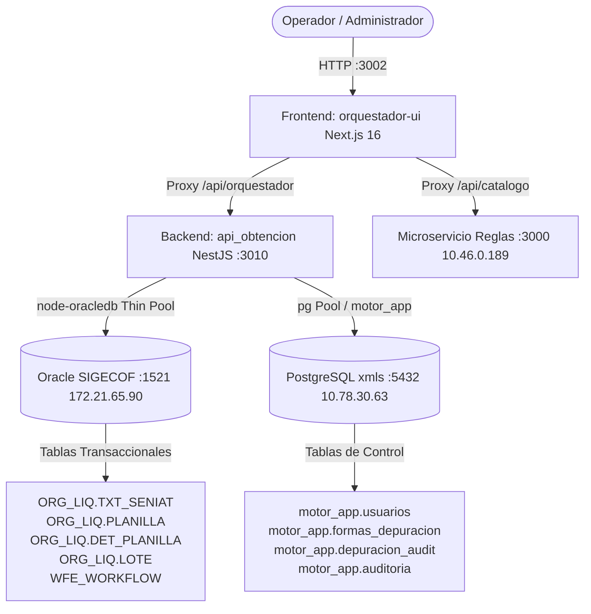

# 🏛️ Sistema Integral de Conciliación y Liquidación Tributaria (ONT - SIGECOF)

Sistema institucional para la automatización, resolución presupuestaria, conciliación atómica en **Oracle SIGECOF** y depuración autorizada de expedientes del **SENIAT** y el **Sistema Financiero Nacional**.

---

## 📐 1. Arquitectura y Componentes del Sistema

El ecosistema está compuesto por dos aplicaciones principales y sus integraciones a bases de datos corporativas:



### 🧩 Módulos Incluidos:
1. **🚀 Orquestador de Conciliación Masiva:** Búsqueda paginada (hasta 10.000 planillas), mapeo concurrente de partidas y conciliación atómica en bloque PL/SQL en milisegundos con botón de detención instantánea (`AbortController`).
2. **🧹 Depuración Autorizada de Formas:** Detección de formas no tributarias/no procesables (`79984`, `99008`, `00084`, `79084`, etc.), eliminación segura de `TXT_SENIAT` con confirmación por contraseña administrativa y trazabilidad en PostgreSQL.
3. **📚 Catálogo de Formas y Reglas:** Asignación y actualización en tiempo real de tipos de resolución (Directa, Biyectiva, Anclada, Prorrateo) con versionado histórico.
4. **👥 Gestión de Usuarios y RBAC:** Creación, edición, activación/inactivación y asignación de roles (Operador, Supervisor, Administrador) con contraseñas seguras bajo `bcrypt`.
5. **📜 Auditoría Transaccional:** Registro completo de eventos, lotes, operadores y montos conciliados.

---

## ⚙️ 2. Variables de Entorno (`.env`)

Crea un archivo `.env` en la raíz del proyecto y en el directorio `api_obtencion/.env` basándote en la plantilla `.env.example`:

```ini
# ==============================================================================
# PUERTOS Y SERVICIOS
# ==============================================================================
PORT=3010
FRONTEND_PORT=3002

# ==============================================================================
# BASE DE DATOS ORACLE (SIGECOF)
# ==============================================================================
ORACLE_HOST=172.21.65.90
ORACLE_PORT=1521
ORACLE_SERVICE_NAME=estatal
ORACLE_SID=cert_rep
ORACLE_USER=ONT_SIR_BOT
ORACLE_PASSWORD=ONT_SIR_BOT123456

# ==============================================================================
# BASE DE DATOS POSTGRESQL (CONTROL, AUDITORÍA Y USUARIOS)
# ==============================================================================
PG_HOST=10.78.30.63
PG_PORT=5432
PG_DATABASE=xmls
PG_USER=ont
PG_PASSWORD=123456

# ==============================================================================
# SEGURIDAD Y TOKEN JWT
# ==============================================================================
JWT_SECRET=SIRONT_SECRET_KEY_2026_VENEZUELA

# ==============================================================================
# URLs DE ENLACE DE PROXY (FRONTEND)
# ==============================================================================
API_BACKEND_URL=http://localhost:3010
CATALOGO_API_URL=http://10.46.0.189:3000
```

---

## 🐳 3. VÍA 1: Despliegue con Docker y Docker Compose (Recomendado)

Esta vía empaqueta el Backend (NestJS) y el Frontend (Next.js) en imágenes de contenedor optimizadas basadas en `node:20-alpine`, garantizando aislamiento, reproducibilidad y arranque automático.

### 3.1. Requisitos Previos:
- Docker Engine $\ge 24.0$
- Docker Compose $\ge 2.20$

### 3.2. Construir e Iniciar los Contenedores:
Ejecuta en la raíz del proyecto:

```bash
# Construir las imágenes y levantar los contenedores en segundo plano
docker compose up -d --build
```

### 3.3. Comandos Útiles de Administración Docker:

```bash
# Ver el estado de los contenedores
docker compose ps

# Ver logs en tiempo real de ambos servicios
docker compose logs -f

# Ver logs únicamente del Backend
docker compose logs -f api_obtencion

# Ver logs únicamente del Frontend
docker compose logs -f orquestador_ui

# Reiniciar los servicios
docker compose restart

# Detener los servicios
docker compose down
```

---

## 💻 4. VÍA 2: Despliegue Nativo con Build de Node.js (PM2 / Systemd)

Esta vía es ideal para servidores Linux físicos o VMs donde se requiera ejecución nativa sobre el sistema operativo mediante el gestor de procesos **PM2**.

### 4.1. Requisitos Previos:
- Node.js LTS $\ge 20.x$
- NPM $\ge 10.x$
- PM2 (`npm install -g pm2`)

### 4.2. Compilación de Producción Automatizada:
Ejecuta el script unificado de compilación:

```bash
chmod +x build_all.sh
./build_all.sh
```

*(O compila manualmente cada módulo)*:
```bash
# 1. Backend
cd api_obtencion
npm install
npm run build
cd ..

# 2. Frontend
cd orquestador-ui
npm install
npm run build
cd ..
```

### 4.3. Iniciar con PM2 (Ecosystem):
El proyecto incluye un archivo [`ecosystem.config.js`](file:///home/estacion/Escritorio/contexto%20y%20procesos%20ONT/ecosystem.config.js) preconfigurado.

```bash
# Iniciar ambos servicios en segundo plano con PM2
pm2 start ecosystem.config.js

# Ver el estado de los procesos
pm2 status

# Ver logs en vivo
pm2 logs

# Guardar la configuración para que inicien automáticamente al reiniciar el servidor
pm2 save
pm2 startup
```

### 4.4. Comandos de Gestión con PM2:

```bash
# Reiniciar el Backend
pm2 restart ont-backend-api

# Reiniciar el Frontend
pm2 restart ont-frontend-ui

# Detener todos los servicios
pm2 stop all
```

---

## 🗄️ 5. Configuración de Base de Datos PostgreSQL (`motor_app`)

Al migrar a un nuevo servidor PostgreSQL, asegúrate de crear el esquema `motor_app` y sus tablas de soporte:

```sql
-- 1. Crear Esquema
CREATE SCHEMA IF NOT EXISTS motor_app;

-- 2. Tabla de Usuarios
CREATE TABLE IF NOT EXISTS motor_app.usuarios (
    id SERIAL PRIMARY KEY,
    nombre VARCHAR(100) NOT NULL,
    email VARCHAR(100) UNIQUE NOT NULL,
    password_hash VARCHAR(255) NOT NULL,
    rol VARCHAR(50) DEFAULT 'OPERADOR',
    departamento VARCHAR(100),
    activo BOOLEAN DEFAULT TRUE,
    fecha_creacion TIMESTAMP DEFAULT CURRENT_TIMESTAMP,
    ultimo_acceso TIMESTAMP
);

-- Usuario Administrador por Defecto (Clave: admin123)
INSERT INTO motor_app.usuarios (nombre, email, password_hash, rol, departamento, activo)
VALUES ('Administrador ONT', 'admin@ont.gob.ve', '$2a$10$wN1iN2h0P3e4q5r6s7t8u.Z1X2y3W4v5U6t7S8r9Q0p1O2n3M4l5K', 'ADMIN', 'Tecnología', true)
ON CONFLICT (email) DO NOTHING;

-- 3. Tabla de Formas en Depuración
CREATE TABLE IF NOT EXISTS motor_app.formas_depuracion (
    id SERIAL PRIMARY KEY,
    forma_codigo VARCHAR(20) UNIQUE NOT NULL,
    descripcion VARCHAR(255) NOT NULL,
    activo BOOLEAN DEFAULT TRUE,
    fecha_creacion TIMESTAMP DEFAULT CURRENT_TIMESTAMP,
    usuario_creacion VARCHAR(100) DEFAULT 'SISTEMA'
);

-- Semilla de Formas a Depurar
INSERT INTO motor_app.formas_depuracion (forma_codigo, descripcion) VALUES
('79984', 'Forma no tributaria / Depuración obligatoria'),
('99008', 'Forma especial fuera de catálogo SIGECOF'),
('00084', 'Forma histórica no procesable'),
('84',    'Forma 84 no tributaria'),
('79084', 'Forma 79084 fuera de liquidación'),
('99001', 'Forma sin partida presupuestaria en SIGECOF')
ON CONFLICT (forma_codigo) DO NOTHING;

-- 4. Tabla de Auditoría de Depuración
CREATE TABLE IF NOT EXISTS motor_app.depuracion_audit (
    id SERIAL PRIMARY KEY,
    forma_codigo VARCHAR(20) NOT NULL,
    cantidad_registros INTEGER NOT NULL,
    fecha_recaudacion DATE NOT NULL,
    banco_codigo VARCHAR(10) NOT NULL,
    usuario VARCHAR(100) NOT NULL,
    motivo VARCHAR(255) NOT NULL,
    fecha_ejecucion TIMESTAMP DEFAULT CURRENT_TIMESTAMP
);
```

---

## 🚀 6. Guía de Migración a un Servidor Nuevo (Paso a Paso)

1. **Clonar o Copiar la Carpeta del Proyecto** en el servidor destino (ej. `/opt/ont-conciliacion` o `/home/administrador/ont-conciliacion`).
2. **Configurar el archivo `.env`:**
   ```bash
   cp .env.example .env
   cp .env.example api_obtencion/.env
   # Editar con los accesos de BD del nuevo entorno
   nano api_obtencion/.env
   ```
3. **Verificar Conectividad de Red hacia las Bases de Datos:**
   ```bash
   # Comprobar Oracle SIGECOF
   nc -zv 172.21.65.90 1521
   
   # Comprobar PostgreSQL
   nc -zv 10.78.30.63 5432
   
   # Comprobar Microservicio de Reglas
   nc -zv 10.46.0.189 3000
   ```
4. **Abrir Puertos en el Firewall del Servidor (UFW o FirewallD):**
   ```bash
   # Permitir acceso al Frontend (3002) y Backend (3010)
   sudo ufw allow 3002/tcp
   sudo ufw allow 3010/tcp
   ```
5. **Desplegar la Aplicación:**
   - **Opción Docker:** `docker compose up -d --build`
   - **Opción PM2:** `./build_all.sh && pm2 start ecosystem.config.js && pm2 save`

---

## 🧪 7. Pruebas de Salud y Validación del Despliegue

```bash
# 1. Probar API Backend
curl -i http://localhost:3010/

# 2. Probar Consulta de Planillas
curl -s "http://localhost:3010/api/planillas/pendientes?fecha=2024-04-16&banco=105&limit=5"

# 3. Probar Frontend Web
curl -I http://localhost:3002/
```

Acceder desde el navegador a: **`http://<IP-DEL-SERVIDOR>:3002`**

---

### 🛡️ Mantenimiento y Soporte
- **Desarrollado para:** Oficina Nacional del Tesoro (ONT) & Dirección General de Liquidación.
- **Tecnologías:** NestJS 11, Next.js 16, TypeScript, OracleDB Thin Driver, PostgreSQL, Docker, PM2.
