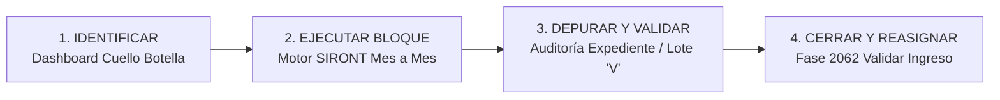

# B—04 Diseño de Dashboards en Metabase para monitorear asignaciones y expedientes e identificar cuellos de botella operativos

**Documento Técnico - Estrategia de Monitoreo y Conciliación por Bloques**  
**Proyecto:** Sistema Integrado de Recaudación y Conciliación ONT / SIRONT  
**Módulo:** Dashboards Analíticos Metabase (`CONCILIACION - 2024`)  
**Ubicación:** `docs/B-04_DISENO_DASHBOARDS_METABASE_CUELLOS_BOTELLA.md`

---

## 1. Visión General y Propósito Operativo

El presente documento establece las pautas de diseño, interpretación y uso operativo de los **Dashboards en Metabase** para el monitoreo integral de las asignaciones, expedientes y volumen de recaudación de la Oficina Nacional del Tesoro (ONT).

El objetivo central de este tablero analítico no es únicamente la presentación estática de datos, sino servir como un **Centro de Mando Operativo** para supervisar la ejecución de las conciliaciones masivas.

### Principios Fundamentales del Flujo Operativo:

1. **Conciliación Controlada por Bloques Automatizados**:  
   En esta fase, la conciliación no se ejecuta de manera anárquica o manual planilla por planilla. Se realiza de **forma controlada por bloques automatizados** a través del motor orquestador (SIRONT), procesando la recaudación de manera sistemática **mes a mes**.
2. **Soporte Estratégico de los Transcriptores**:  
   Los transcriptores y analistas operan como auditores y validadores del proceso. Hacen uso de las herramientas de depuración, resolución de formas especiales (ej. `99044`), manejo de duplicados en archivos TXT y validación de notas de crédito.
3. **Mapas de Ruta (Por dónde empezar y por dónde terminar)**:  
   Los dashboards en Metabase brindan la visibilidad estratégica necesaria para que la coordinación operativa observe con claridad **por dónde iniciar** el procesamiento masivo automatizado (identificando meses, bancos o lotes con mayor densidad) y **por dónde finalizar**, asegurando el cierre definitivo del expediente y su pase a la siguiente fase de validación en SIGECOF (`Tarea 2062`).

---

## 2. Estructura del Dashboard en Metabase (`CONCILIACION - 2024`)

El Dashboard institucional está estructurado en **tres (3) vistas/pestañas principales**, cada una orientada a un nivel específico de control operativo y analítico:

```
┌─────────────────────────────────────────────────────────────────────────┐
│                        DASHBOARD: CONCILIACION - 2024                   │
├──────────────────────────┬──────────────────────┬───────────────────────┤
│ 1. CUELLO BOTELLA        │ 2. AUDITORÍA         │ 3. AUDITORÍA          │
│    (Visión Macro y Ruta) │    EXPEDIENTE        │    USUARIO            │
│                          │    (Micro-Detalle)   │    (Carga Transcriptor│
└──────────────────────────┴──────────────────────┴───────────────────────┘
```

---

### 2.1. Pestaña 1: Cuello Botella (Monitoreo Forense y Priorización)

Esta vista proporciona el panorama macro de la recaudación del ejercicio fiscal (ej. 2024), permitiendo identificar de forma inmediata los cuellos de botella en la transcripción y conciliación.

#### A. Filtros Globales Superiores
- **`Estado Expediente`**: Permite filtrar por estado del workflow en SIGECOF (`ABIERTA`, `PENDIENTE`, `CERRADA`).
- **`Banco`**: Código institucional de la entidad recaudadora (ej. `102`, `105`, `134`, `163`, `172`, `175`, `191`).
- **`Fecha`**: Rango temporal o mes de recaudación (ej. `2024-04`).
- **`Usuario Transcriptor`**: Filtrado individual o por grupo de analistas.

#### B. Componentes Analíticos y Gráficos
1. **Cantidad de Planillas Pendientes por Estado de Workflow**:  
   Muestra el acumulado de planillas en tareas con estado `ABIERTA` vs. `PENDIENTE` (ej. 95 en `ABIERTA`, 22 en `PENDIENTE`), indicando la fase exacta donde se encuentran retenidas.
2. **Cantidad de Planillas Pendientes según Transcriptor**:  
   Grafica la distribución del trabajo pendiente entre los analistas activos (ej. *Gilliams Francisconi*, *Ivonne Colón*, *Jhonny Dobla*, *Larry Durán*, *Sandra Hurtado*, etc.).
3. **Cantidad de Planillas Pendientes según Banco**:  
   Permite visualizar qué entidad financiera concentra el mayor saldo por conciliar (ej. Banco `191` con 29 expedientes, Banco `175` con 24 expedientes, Banco `163` con 23 expedientes).
4. **Histograma de Frecuencia Temporal (`FECHA_MIN_RECAUDACION`)**:  
   Muestra la distribución cronológica diaria del mes evaluado (ej. abril 2024), exponiendo los picos de entrada de recaudación y permitiendo definir el orden cronológico de ejecución.
5. **Data Guía (Data Asset Tabular a Nivel de Expediente)**:  
   Tabla detallada que agrupa por expediente único con las siguientes columnas clave:
   - `NRO_EXPEDIENTE` y `EJERCICIO_ANHO` (ej. Expediente `7986`, año `2024`).
   - `LOTES_PENDIENTES` y `PLANILLAS_PENDIENTES` (ej. 43 lotes, 10,148 planillas).
   - `EFECTIVO_BS`, `OTROS_PAGOS_BS` y `MONTO_TOTAL_EXPEDIENTE_BS` (ej. Bs. 349.283.670,16).
   - `FECHA_MIN_RECAUDACION` y `FECHA_MAX_RECAUDACION`.
   - `CODIGO_BANCO`, `ID_TRANSCRIPTOR`, `NOMBRE_TRANSCRIPTOR` y `ESTADO_WORKFLOW`.

---

### 2.2. Pestaña 2: Auditoría Expediente (Control Fino de Lotes y Planillas Faltantes)

Esta pestaña desciende al nivel micro para inspeccionar la composición interna de un expediente específico cuando se detectan discrepancias.

#### A. Filtros Específicos
- `Usuario`, `Estado Expediente`, `Año Lote` (ej. 2024 / 2025), `Estado Lote` (`P` vs `V`), `Número Expediente`, `Número Lote`, `Planilla Faltante`.

#### B. Componentes de Control
1. **Listado Expedientes Vs Lotes**:  
   Inspecciona la secuencia interna de los lotes pertenecientes a un expediente, verificando el banco (`128`), agencia (`0001`, `0077`, `0800`), fecha de recaudación, planillas declaradas y el estado del lote en `ORG_LIQ.LOTE` (`P` = Pendiente, `V` = Validado).
2. **Lotes Abiertos**:  
   Muestra únicamente los lotes del expediente que continúan en `ESTADO = 'P'`, facilitando la acción de cierre masivo.
3. **Cantidad de Planillas Conciliadas**:  
   Métrica de confirmación de los registros que ya fueron insertados de manera efectiva en la base de datos (`CONCILIADA EN BD`).
4. **Pendientes Por Conciliar V2 (Detalle Planilla por Planilla)**:  
   Lista exhaustiva de las planillas faltantes en el archivo TXT SENIAT con su número de planilla, forma tributaria (ej. `99044`), monto exacto, banco, agencia y estatus de carga (`PENDIENTE POR CARGAR`).

---

### 2.3. Pestaña 3: Auditoría Usuario (Perfil Operativo y Desempeño del Analista)

Diseñada para la coordinación de gestión humana y supervisión de cargas de trabajo.

#### A. Ficha y Perfil del Analista
- **Identificación**: Muestra el `USUARIO_SISTEMA` (ej. `GILLIAMS_0028`), Nombre Corto (`GILLIAMS`), Apellido (`FRANCISCONI`), Cédula de Identidad (`6433206`), Fecha de Creación del Usuario (`05/06/2019`) y Estado (`ACTIVO`).

#### B. Indicadores de Carga de Trabajo
1. **Cantidad de Expedientes Históricos**: Total acumulado asignado al usuario (ej. `15,090` expedientes).
2. **Asignaciones 2024**: Desglose de expedientes activos en el ejercicio actual (ej. `15,009` en estado `ABIERTA`, `81` en estado `PENDIENTE`).
3. **Línea Temporal de Asignaciones**: Gráfico de tendencia que muestra el flujo de expedientes asignados al usuario a lo largo de los años (2019 al 2026).
4. **Ejercicio Fiscal 2024 - Listado Expedientes**: Tabla detallada con el usuario asignador (`CON_AUTOMATICA1` / `PEDRO FERNANDEZ`), expediente, banco, fecha del lote y fecha/hora exacta de asignación.

---

## 3. Metodología de Conciliación Controlada por Bloques y Mapa de Ruta

La combinación del **Orquestador SIRONT** y los **Dashboards de Metabase** permite implementar una metodología de trabajo estructurada en 4 pasos:



### Paso 1: Identificación y Priorización (¿Por dónde empezar?)
- El supervisor consulta la Pestaña 1 (**Cuello Botella**).
- Filtra por el ejercicio fiscal `2024` y analiza el **Histograma Temporal** y la tabla **Data Guía**.
- Identifica el mes con mayor concentración de planillas o el banco con mayor volumen acumulado (ej. Banco `102` o `191` en abril 2024).
- **Decisión:** Se selecciona el **bloque mensual** que se enviará al procesamiento masivo.

### Paso 2: Ejecución Automatizada por Bloques
- El operador abre el **Orquestador SIRONT**, selecciona la fecha y el banco del bloque prioritario.
- Lanza el proceso de **Conciliación Masiva Automatizada**.
- El sistema procesa en lote miles de planillas por minuto, registrándolas en `ORG_LIQ.PLANILLA` y `ORG_LIQ.DET_PLANILLA`.

### Paso 3: Depuración y Resolución de Excepciones
- Para las planillas que presentan particularidades (Formas especiales como `99044`, registros duplicados en TXT o inconsistencias de atributos), el analista utiliza la Pestaña 2 (**Auditoría Expediente**) y los módulos del Orquestador.
- Se ejecutan las rutinas de depuración autorizada y ajuste automático de lotes.
- Todos los lotes del expediente pasan progresivamente de `ESTADO = 'P'` a **`ESTADO = 'V'`**.

### Paso 4: Cierre de Expediente y Reasignación (¿Por dónde terminar?)
- Una vez verificado en Metabase que el expediente tiene **0 planillas pendientes** y el **100% de sus lotes en estado 'V'**, el operador hace clic en el botón **"Cerrar Expediente"** en el Orquestador.
- Selecciona al analista revisor desde el panel desplegable.
- El sistema ejecuta la transición atómica en Oracle Workflow, cerrando el workitem actual e insertando la **Tarea 2062 (`Validar Conciliación de Ingreso`)**.
- El expediente queda oficialmente completado en la fase de transcripción/conciliación.

---

## 4. Conclusiones y Valor Operativo

1. **Eficiencia Estandarizada**: Se elimina la incertidumbre operativa. Los analistas saben exactamente qué expediente tomar y en qué orden procesar los bloques mensuales.
2. **Cero Cuellos de Botella Ocultos**: La visualización en tiempo real expone de inmediato expedientes retenidos o cargas desproporcionadas entre transcriptores.
3. **Trazabilidad Total**: Toda acción iniciada desde la lectura analítica en Metabase hasta la ejecución en el Orquestador queda respaldada con registros de auditoría en PostgreSQL y Oracle Workflow.
